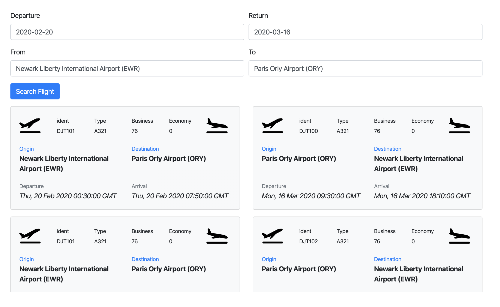
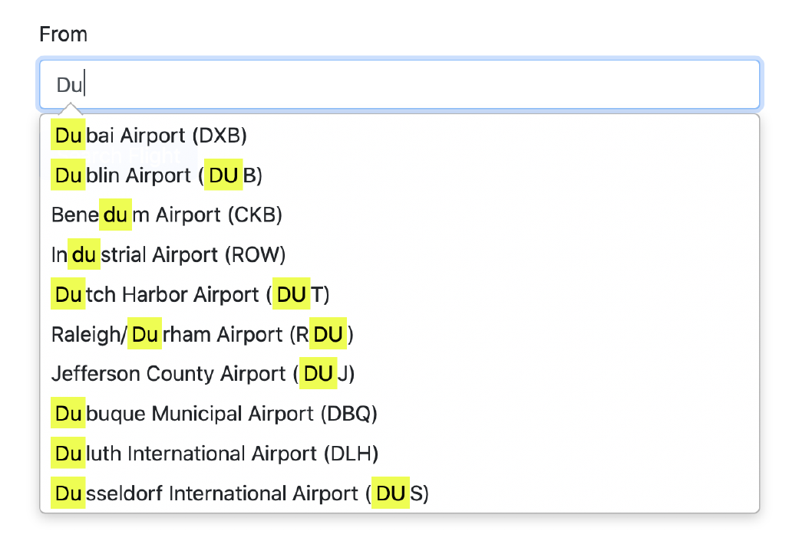

# Flight-Search-Tool

Flight search tool returns the flights for requested airports. The result includes the flights between the 10 closest airports to origin and 10 closest airport to destination. For example, if user enters CLT as their origin airport, and EWR as their destination airport, user might receive flights for such routes as: CLT-EWR, CLT-LGA, CLT-HPN, CLT-TTN for origin to destination and EWR-CLT, EWR-MYR, EWR-CHS, EWR-TYS for destination to origin.

[Click here](https://www.youtube.com/watch?v=O2AGzuvsNx0) to watch the demonstration of the application.

Technologies - Express.js, EJS, Bootstrap, MySQL, REST Api

- The User Interface is implemented using and EJS and BootStrap.
- Datepicker is added for user to choose Departure Date and Return Date.
- The Autocomplete Text is added for Departure Airport and Arrival Airport. The Airport information is fetched from MySQL database to put inside suggestions.
- Input validations for Dates.
- The grid on the left display Origin to Destination flight while the grid on right display Destination to Origin.
- The REST API fetch all 15 flights from origin to destination.
- I have used geolib npm library to calculate the nearest airport from origin and destination. The library calculates the nearest airports using LatLong information.
- After getting the 10 nearest airports the REST APIs is used to obtain one result each for all the 10 airports.
- If there are no flights returned by the API it will not be added to List and application will
show only the available flights around nearest airports.
